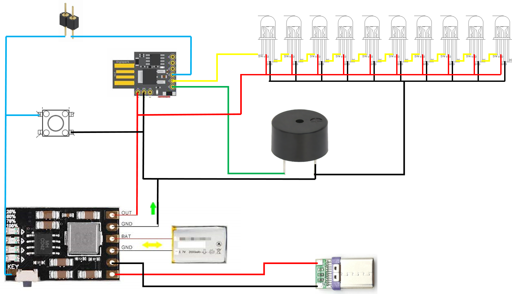

# CarreraGO-Startampel
Fork von https://github.com/MoritzFeiler/CarreraGO-Startampel MoritzFeiler
Angepasste LEDs und nutzung eines digistump/attiny88 und eines Akkus mit einem Charge Discharge Modul, geladen wird über USB-C

1. [Material](#material)
2. [Hardware](#hardware)
3. [Software](#software)
4. [Gehäuse](#gehäuse)

Sollte es weitere Fragen, Anregungen oder Feedback geben bin ich am besten über die [Youtube-Kommentare](https://youtu.be/q5Slh3TaYYY) oder [Twitter](https://twitter.com/FeilerMoritz) zu erreichen. Viel Spaß beim Nachbauen! 

---
## Material:

- Digistump
- 10x RGB-LED (APA106 5mm)
- Lochrasterplatine 
- aktiver Piezo Buzzer
- Schaltlitze
- Stift- und Buchsenleiste
- MH-CD42
- Akku

Neben den aufgelisteten Materialen ist eigentlich nur ein Lötkolben, Lötzinn sowie die entsprechende Software zum Hochladen des Arduino-Programms notwendig. Das Gehäuse der Startampel habe ich an einem Creality Ender-3 ausgedruckt. Alternativ hierzu lässt sich die Konstruktion auch aus Holz, Pappe oder ähnlichem bauen. 

---
## Hardware

---
## Software
Die Startsequenz der Ampel soll folgendermaßen ablaufen:
- alle roten LEDs an (10 Sekunden)
- alle LEDs aus (5 Sekunden)
- Start Countdown
- nacheinander Aufleuchten der roten LEDs (1/Sekunde)
- zufallsgenerierte Pause (0,5 - 1,2 Sekunden)
- Aufleuchten aller grünen LEDs (2 Sekunden)
- alle LEDs aus

--- 
## Gehäuse
Hier gibt es viele verschiedene Möglichkeiten. Wie bereits erwähnt, habe ich das Gehäuse an meinem 3D-Drucker ausgedruckt. Die .stl-Dateien, sowie alle originalen Solidworks CAD-Dateien sind im _Gehäuse_-Ordner zu finden. Auch die Schablone die ich zum Ausrichten der LEDs verwendet habe findet ihr dort. Solltet ihr keinen 3D-Drucker haben lässt sich das Gehäuse mit ein bisschen handwerklichem Geschick und Kreativität bestimmt auch aus Holz, Pappe oder ähnlichem Material selber bauen. 

